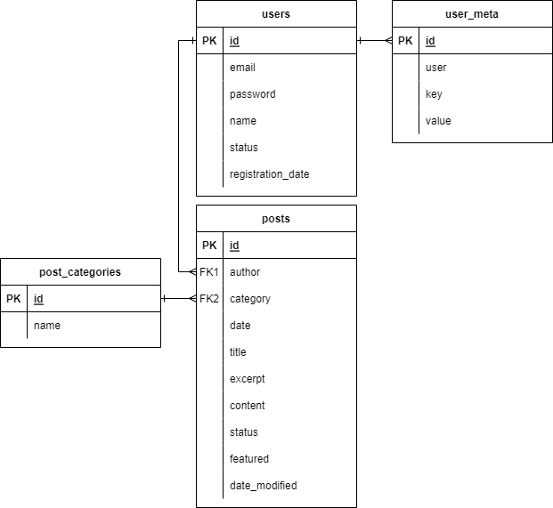

# trabalhoPW_6160 - Database

Base de Dados do projeto, utilizando SQL no servidor PostgreSQL.

## Modelo da Base de Dados

A Base de dados utiliza o seguinte modelo:

## Desenvolvimento

Ao executar este script, é criado um schema na Base de Dados e de seguida, são criadas tabelas, Chaves e Relações.

No final é inserido alguns dados de padrão, como uma categoria padrão, um utilizador e um artigo.
